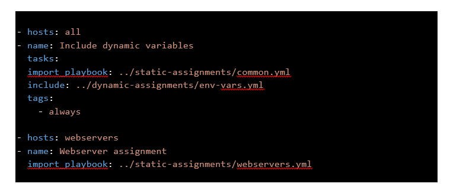

# ANSIBLE-DYNAMIC-ASSIGNMENTS-AND-IMPORTS-COMMUNITY-ROLE
<<<<<<< HEAD
## Ansible Dynamic -Assignment &; Community Role

  # ANSIBLE DYNAMIC ASSIGNMENTS (INCLUDE) AND COMMUNITY ROLES

## Introduction
### Unleashing the flexibility of Ansible Dynamics, Assignments, and Community Roles! In this introduction, we are going to set the stage for our project, providing context, defining the purpose, and explaining why it is crucial in automation and configuration management.

### What is ansible dynamic assignment?

### Dynamic assignments in ansible refer to the use of variables whose values are calculated or determined at runtime. This is in contrast to static assignments, where the values of variables are defined and fixed at the time of writing the playbook.

## Importance Of Ansible Dynamics

### The biggest ansible advantages is the designed for multi-tier deployments since starting. Ansible handle IT infrastructure by describing all of your systems interrelate, rather than just managing one system at a time. It uses no agents and no additional custom security infrastructure.

## Ansible is an automation tool specifically designed for Configuration Management System tasks. In simple terms, Ansible allows you to maintain your systems in a desired state, and to configure multiple machines quickly and consistently.

## Target Audience

### Ansible dynamics project is for DevOps engineers, IT manager and anyone eager to harness the power of Ansible for efficient automation.

## Project Goals
### By the end of ansible dynamics project, learners should be proficient in leveraging dynamic inventories, assigning tasks effectively, and utilizing community roles to streamline your Ansible workflows. The goals include mastering advanced Ansible concepts, fostering collaboration through community roles, and empowering learners to apply these skills to real-world cases and experiences

## Introducing Dynamic Assignment Into Our Structure
### In the last project, we refactored ansible code, also assigned and imported into our playbooks

### In the last project, we refactored ansible code, also assigned and imported into our playbooks

### From project 12 we can say boldly that stati assignment make use of import Ansible module, so the module that enable dynamic-assignment is `include` 
`import = Static`
`include = Dynamic`

1.	In our [git hub account](https://github.com//ansible-config-mgt) 
GitHub repository  we are going 
start a new  branch  and call it **dynamic-assignments**.
2.	Then create a new folder, name it **dynamic-assignments**.
3.	 Then inside this folder, create a new file and name it **env-vars.yml**. 
4.	We will instruct site.yml to include this playbook later.

### Our GitHub shall have following structure by now.
>Note: Depending on what method you used in the previous project you may have or not have roles folder in your GitHub repository – if you used ansible-galaxy, then roles directory was only created on your Jenkins-Ansible server locally. 
### It is recommended to have all the codes managed and tracked in GitHub, so you might want to recreate this structure manually in this case.

Our GitHub shall have following structure by now

### Since we will are going nto use ansible to configure multiple environment’s, and each of this environments’ will have a unique attributes like server name, IP address and so on. Then we will need a way to set value to variable by specific enviroments 

### For this reason, we will now create a folder to keep each environment variables file.
### Therefore create a new folder called env-vars, then for new for each environment create new YAML file
### Which we will use to set variables.

## Our layout will now look like this

## Put below code in env-var.yml
`---
- name: collate variables from env specific file, if it exists
  hosts: all

  tasks:
    - name: looping through list of available files
      include_vars: "{{ item }}"
      with_first_found:
        - files:
            - dev.yml
            - stage.yml
            - prod.yml
            - uat.yml
          paths:
            - "{{ playbook_dir }}/../env-vars"
      tags: 
        - always`

### Update site.yml file with dynamic-assignment
### Update site.yml file to make use of the dynamic assignment. 
** (At this point, we cannot test it yet. We are just setting the stage for what is yet to come. So hang on to your hats)**

### site.yml  should now look like this

**COMMUNITY ROLES**

## Now it is time to create a role for MySQL database

### It should install the MySQL package, create a database and configure users. But why should we re-invent the wheel? 
### There are tons of roles that have already been developed by other open-source engineers out there. These roles are actually production ready, and dynamic to accommodate most of Linux flavours. With Ansible Galaxy again, we can simply download a ready to use ansible role, and keep going.

### Download Mysql Ansible Roles
### of course git must have been installed on our ansible-jenkins server 
### Check check git version with below command 
`git --version

### We will be using a MySQL role developed by geerlingguy
### Inside roles directory create your new MySQL role with 
*ansible-galaxy install geerlingguy.mysql -p .*

Then rename the folder to mysql with below command

`mv geerlingguy.mysql/mysql`

### Then
### Inside roles directory create your new NGINX role with 
`ansible-galaxy install geerlingguy.nginx -p .`

Then rename the folder to nginx with below command

`mv geerlingguy.nginx/ nginx`

### Inside roles directory create your new APACHE with

`ansible-galaxy install geerlingguy.apache -p .`

Then rename the folder to apache with below code

`mv geerlingguy.apache/ apache`

### We are going to use readme to edit roles file downloaded

**LOAD BALANCER ROLES**

### We want to be able to choose which Load Balancer to use, either Nginx or Apache, so we need to have two roles respectively:

### Important Hint
-	Since you cannot use both Nginx and Apache load balancer, you need to add a condition to enable either one – this is where you can make use of variables.
- Declare a variable in defaults/main.yml file inside the Nginx and Apache roles. Name each variables enable_nginx_lb and enable_apache_lb respectively.
- Set both values to false like this enable_nginx_lb: false and enable_apache_lb: false.
-	Declare another variable in both roles load_balancer_is_required and set its value to false as well
-	Update both assignment and site.yml files respectively

Update loadbalancer.yml file with below code
loadbalancers.yml file
- hosts: lb
  roles:
    - { role: nginx, when: enable_nginx_lb and load_balancer_is_required }
    - { role: apache, when: enable_apache_lb and load_balancer_is_required }

### Update your site.yml yml with below command

     - name: Loadbalancers assignment
       hosts: lb
         - import_playbook: ../static-assignments/loadbalancers.yml

        when: load_balancer_is_required

### Now we can make use of env-vars\uat.yml file to define which loadbalancer to use in UAT environment by setting respective environmental variable to true.

### We will activate load balancer, and enable apache by setting these in the respective environment’s env-vars file.

`enable_apache_lb: true`
`load_balancer_is_required: true`

### The same must work with nginx LB, so you can switch it by setting respective environmental variable to true and other to false.

### Run Playbook using ansible-playbook -i inventory/uat.yml playbooks/site.yml ensure you are inside ansible-config-mgt.

`ansible-playbook -i inventory/uat.yml playbooks/site.yml`

### From project **11 to project 13**, we have been able to learn about ansible principle and appli cations.  Ansible Dynamics, Assignments, and Community Roles offer a transformative journey in automation.

### we were equipped with the tools to seamlessly adapt to dynamic infrastructures, delegate tasks effectively, and to collaborate with a vibrant community. 
### We have learnt how to automate easily.
### Knowledge acquired can be reapply in the real-world scenario 

